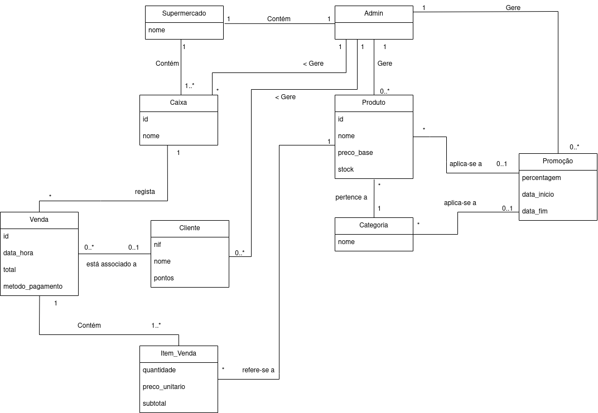

# Modelação de Domínio

O Modelo de Domínio representa conceptualmente as entidades do mundo real e as suas interações no contexto do supermercado.

## Regras de Notação Aplicadas:
- **Entidades:** Em MAIÚSCULAS (ex: PRODUTO, VENDA, CAIXA, CLIENTE, PROMOÇÃO, CATEGORIA).
- **Atributos:** Em minúsculas (ex: preco, nome, quantidade, nif, pontos, percentagem, data_inicio, data_fim).
- **Relacionamentos:** Identificados por verbos e com indicação de multiplicidade. O sentido de leitura normal é da esquerda para a direita e de cima para baixo. Em casos onde a leitura ocorre no sentido inverso (ex: da direita para a esquerda ou de baixo para cima), o verbo é acompanhado de um indicador de direção (ex: `< Gere` ou `Gere >`). 
  - Exemplos: `1 ADMIN Gere > 0..* CAIXA` (leitura da direita para a esquerda indicada pelo `>`); `0..1 CLIENTE está associado a 0..* VENDA` (leitura normal); `1 CATEGORIA Contém 1..* PRODUTO`.
