# Modelo de Casos de Uso

Nesta secção detalhamos as interações entre os atores e o sistema.

| ID | Caso de Uso | Ator(es) | Descrição Resumida |
| :--- | :--- | :--- | :--- |
| **UC01** | Gerir Catálogo | ADMIN | Permite criar, editar, listar e remover PRODUTOS (com ID automático). |
| **UC02** | Consultar Estatísticas | ADMIN | Gera relatórios de faturação e volume por CAIXA ou global. |
| **UC03** | Gerir Utilizadores | ADMIN | Permite o registo e remoção de contas de perfil 'CAIXA'. |
| **UC04** | Repor Stock | ADMIN | Incrementa a quantidade disponível de um PRODUTO existente. |
| **UC05** | Realizar VENDA | CAIXA | Inicia transação, adiciona itens, calcula total e regista pagamento. |
| **UC06** | Consultar Preço | CAIXA | Pesquisa e exibe o preço unitário de um PRODUTO pelo seu ID. |
| **UC07** | Consultar Info e Histórico | CAIXA | Exibe dados do funcionário, o seu total e histórico detalhado de VENDAS. |
| **UC08** | Gerir CLIENTES | ADMIN | Permite o registo, edição e remoção de perfis de CLIENTE com fidelização. |
| **UC09** | Associar CLIENTE | CAIXA | Durante a VENDA, permite ligar a transação a um CLIENTE existente. |
| **UC10** | Consultar Pontos do CLIENTE | CAIXA | Permite visualizar o saldo de pontos do CLIENTE; o desconto por pontos é aplicado automaticamente pelo sistema no final da VENDA. |
| **UC11** | Gerir PROMOÇÕES | ADMIN | Permite criar, editar e apagar PROMOÇÕES temporárias. |
| **UC12** | Gerir CATEGORIAS | ADMIN | Permite agrupar PRODUTOS em CATEGORIAS para fins de IVA e Descontos. |
| **UC13** | Selecionar Perfil | ADMIN, CAIXA | Identifica o utilizador e o seu papel (sem password) para aceder ao sistema. |
| **UC14** | Sair do Perfil | ADMIN, CAIXA | Termina a sessão do utilizador atual, regressando ao menu de seleção. |
| **UC15** | Consultar RECIBO | CAIXA | Permite consultar e visualizar o RECIBO de uma VENDA terminada. |

## Especificações de Casos de Uso

### UC01: Gerir Catálogo
| | |
| :--- | :--- |
| **Ator** | ADMIN |
| **Caso de Uso** | Gerir Catálogo |
| **Descrição** | Permite ao ADMIN gerir os PRODUTOS (criar, editar, listar e remover). |
| **Pré-condição** | ADMIN autenticado no sistema. |
| **Pós-condição** | Catálogo de PRODUTOS atualizado na base de dados. |
| **Fluxo Principal** | 1. O ADMIN solicita a gestão do catálogo. 2. O sistema mostra as opções disponíveis (Criar, Editar, Listar, Remover). 3. O ADMIN seleciona "Criar". 4. O sistema solicita os dados (nome, preço, stock, categoria). 5. O ADMIN introduz os dados. 6. O sistema valida os dados, gera um ID automático e grava. 7. O sistema confirma o sucesso da operação. |
| **Caminho Alt.** | N/A (Happy case assumido). |
| **Exceções** | N/A (Happy case assumido). |

### UC02: Consultar Estatísticas
| | |
| :--- | :--- |
| **Ator** | ADMIN |
| **Caso de Uso** | Consultar Estatísticas |
| **Descrição** | Permite visualizar relatórios de faturação global ou por CAIXA. |
| **Pré-condição** | ADMIN autenticado no sistema. |
| **Pós-condição** | N/A (Consulta). |
| **Fluxo Principal** | 1. O ADMIN solicita a consulta de estatísticas. 2. O sistema solicita o filtro desejado (global ou por utilizador CAIXA). 3. O ADMIN escolhe o filtro. 4. O sistema gera e apresenta o relatório de faturação e volume de vendas. |
| **Caminho Alt.** | N/A (Happy case assumido). |
| **Exceções** | N/A (Happy case assumido). |

### UC03: Gerir Utilizadores
| | |
| :--- | :--- |
| **Ator** | ADMIN |
| **Caso de Uso** | Gerir Utilizadores |
| **Descrição** | Permite o registo e remoção de contas de perfil 'CAIXA'. |
| **Pré-condição** | ADMIN autenticado no sistema. |
| **Pós-condição** | Lista de utilizadores autorizados é atualizada. |
| **Fluxo Principal** | 1. O ADMIN solicita a gestão de utilizadores. 2. O ADMIN introduz os dados do novo CAIXA (nome, etc.). 3. O sistema valida os dados e cria a conta de perfil 'CAIXA'. 4. O sistema confirma a criação com sucesso. |
| **Caminho Alt.** | N/A (Happy case assumido). |
| **Exceções** | N/A (Happy case assumido). |

### UC04: Repor Stock
| | |
| :--- | :--- |
| **Ator** | ADMIN |
| **Caso de Uso** | Repor Stock |
| **Descrição** | Incrementa a quantidade disponível de um PRODUTO existente. |
| **Pré-condição** | ADMIN autenticado no sistema. |
| **Pós-condição** | Stock do PRODUTO é incrementado. |
| **Fluxo Principal** | 1. O ADMIN pesquisa o PRODUTO pelo seu ID. 2. O sistema apresenta os dados atuais do PRODUTO. 3. O ADMIN introduz a quantidade a adicionar ao stock. 4. O sistema atualiza o valor do stock na base de dados. 5. O sistema confirma o novo valor total de stock. |
| **Caminho Alt.** | N/A (Happy case assumido). |
| **Exceções** | N/A (Happy case assumido). |

### UC05: Realizar VENDA
| | |
| :--- | :--- |
| **Ator** | CAIXA |
| **Caso de Uso** | Realizar VENDA |
| **Descrição** | Processa uma transação de venda de PRODUTOS a um cliente. |
| **Pré-condição** | CAIXA autenticado no sistema. |
| **Pós-condição** | VENDA registada, stock atualizado e RECIBO emitido. |
| **Fluxo Principal** | 1. O CAIXA inicia uma nova VENDA. 2. O CAIXA introduz o ID e quantidade de cada PRODUTO. 3. O sistema valida o item, calcula o subtotal e apresenta-o. 4. O CAIXA termina a introdução de itens. 5. O sistema calcula o total final (aplicando taxas e promoções). 6. O CAIXA regista o pagamento. 7. O sistema finaliza a VENDA e emite o RECIBO. |
| **Caminho Alt.** | N/A (Happy case assumido). |
| **Exceções** | N/A (Happy case assumido). |

### UC06: Consultar Preço
| | |
| :--- | :--- |
| **Ator** | CAIXA |
| **Caso de Uso** | Consultar Preço |
| **Descrição** | Pesquisa e exibe o preço unitário de um PRODUTO pelo seu ID. |
| **Pré-condição** | CAIXA autenticado no sistema. |
| **Pós-condição** | N/A (Consulta). |
| **Fluxo Principal** | 1. O CAIXA introduz o ID do PRODUTO. 2. O sistema pesquisa o ID. 3. O sistema apresenta o nome e o preço unitário do PRODUTO. |
| **Caminho Alt.** | N/A (Happy case assumido). |
| **Exceções** | N/A (Happy case assumido). |

### UC07: Consultar Info e Histórico
| | |
| :--- | :--- |
| **Ator** | CAIXA |
| **Caso de Uso** | Consultar Info e Histórico |
| **Descrição** | Exibe dados do utilizador CAIXA e o histórico de VENDAS realizadas. |
| **Pré-condição** | CAIXA autenticado no sistema. |
| **Pós-condição** | N/A (Consulta). |
| **Fluxo Principal** | 1. O CAIXA solicita o seu histórico. 2. O sistema apresenta os dados do perfil (ID, nome) e o total faturado. 3. O sistema apresenta a lista detalhada das VENDAS efetuadas por ele. |
| **Caminho Alt.** | N/A (Happy case assumido). |
| **Exceções** | N/A (Happy case assumido). |

### UC08: Gerir CLIENTES
| | |
| :--- | :--- |
| **Ator** | ADMIN |
| **Caso de Uso** | Gerir CLIENTES |
| **Descrição** | Permite o registo, edição e remoção de perfis de CLIENTE. |
| **Pré-condição** | ADMIN autenticado no sistema. |
| **Pós-condição** | Base de dados de CLIENTES atualizada. |
| **Fluxo Principal** | 1. O ADMIN solicita gestão de CLIENTES. 2. O ADMIN seleciona a opção "Registar novo". 3. O ADMIN introduz o NIF e o nome do CLIENTE. 4. O sistema valida o NIF, inicializa o saldo de pontos a zero e guarda o perfil. 5. O sistema confirma o sucesso da operação. |
| **Caminho Alt.** | N/A (Happy case assumido). |
| **Exceções** | N/A (Happy case assumido). |

### UC09: Associar CLIENTE
| | |
| :--- | :--- |
| **Ator** | CAIXA |
| **Caso de Uso** | Associar CLIENTE |
| **Descrição** | Durante uma VENDA, associa o CLIENTE à transação. |
| **Pré-condição** | VENDA em curso. |
| **Pós-condição** | CLIENTE associado à VENDA. |
| **Fluxo Principal** | 1. O CAIXA solicita a associação de um CLIENTE. 2. O CAIXA introduz o NIF do CLIENTE. 3. O sistema valida o NIF e apresenta o nome correspondente. 4. O sistema liga o CLIENTE à VENDA atual. |
| **Caminho Alt.** | N/A (Happy case assumido). |
| **Exceções** | N/A (Happy case assumido). |

### UC10: Consultar Pontos do CLIENTE
| | |
| :--- | :--- |
| **Ator** | CAIXA |
| **Caso de Uso** | Consultar Pontos do CLIENTE |
| **Descrição** | Permite visualizar o saldo de pontos atual de um CLIENTE. |
| **Pré-condição** | CAIXA autenticado no sistema. |
| **Pós-condição** | N/A (Consulta). |
| **Fluxo Principal** | 1. O CAIXA introduz o NIF do CLIENTE. 2. O sistema pesquisa o perfil correspondente. 3. O sistema apresenta o saldo de pontos atual do CLIENTE. |
| **Caminho Alt.** | N/A (Happy case assumido). |
| **Exceções** | N/A (Happy case assumido). |

### UC11: Gerir PROMOÇÕES
| | |
| :--- | :--- |
| **Ator** | ADMIN |
| **Caso de Uso** | Gerir PROMOÇÕES |
| **Descrição** | Permite criar e configurar regras de desconto temporárias. |
| **Pré-condição** | ADMIN autenticado no sistema. |
| **Pós-condição** | Base de dados de PROMOÇÕES atualizada. |
| **Fluxo Principal** | 1. O ADMIN solicita a gestão de PROMOÇÕES. 2. O ADMIN define a percentagem de desconto e as datas de vigência. 3. O ADMIN associa a PROMOÇÃO a um PRODUTO ou CATEGORIA específica. 4. O sistema valida e guarda a regra de desconto. |
| **Caminho Alt.** | N/A (Happy case assumido). |
| **Exceções** | N/A (Happy case assumido). |

### UC12: Gerir CATEGORIAS
| | |
| :--- | :--- |
| **Ator** | ADMIN |
| **Caso de Uso** | Gerir CATEGORIAS |
| **Descrição** | Permite agrupar PRODUTOS para fins de IVA e descontos. |
| **Pré-condição** | ADMIN autenticado no sistema. |
| **Pós-condição** | Lista de CATEGORIAS atualizada. |
| **Fluxo Principal** | 1. O ADMIN solicita a gestão de categorias. 2. O ADMIN introduz o nome da nova CATEGORIA e a respetiva taxa de IVA. 3. O sistema valida os dados e cria a CATEGORIA. 4. O sistema confirma a criação com sucesso. |
| **Caminho Alt.** | N/A (Happy case assumido). |
| **Exceções** | N/A (Happy case assumido). |

### UC13: Selecionar Perfil
| | |
| :--- | :--- |
| **Ator** | ADMIN, CAIXA |
| **Caso de Uso** | Selecionar Perfil |
| **Descrição** | Permite ao utilizador identificar-se e aceder ao menu correspondente. |
| **Pré-condição** | Sistema no menu de seleção inicial. |
| **Pós-condição** | Utilizador autenticado e menu de funções ativo. |
| **Fluxo Principal** | 1. O utilizador seleciona o seu perfil (ADMIN ou um CAIXA específico) de uma lista apresentada. 2. O sistema verifica as permissões do perfil. 3. O sistema apresenta o menu de operações adequado ao papel selecionado. |
| **Caminho Alt.** | N/A (Happy case assumido). |
| **Exceções** | N/A (Happy case assumido). |

### UC14: Sair do Perfil
| | |
| :--- | :--- |
| **Ator** | ADMIN, CAIXA |
| **Caso de Uso** | Sair do Perfil |
| **Descrição** | Termina a sessão do utilizador atual. |
| **Pré-condição** | Utilizador com perfil ativo no sistema. |
| **Pós-condição** | Sessão terminada e sistema regressa ao menu de seleção inicial. |
| **Fluxo Principal** | 1. O utilizador seleciona a opção "Sair" ou "Logout". 2. O sistema limpa os dados de sessão atuais. 3. O sistema regressa ao menu de seleção de perfil inicial. |
| **Caminho Alt.** | N/A (Happy case assumido). |
| **Exceções** | N/A (Happy case assumido). |

### UC15: Consultar RECIBO
| | |
| :--- | :--- |
| **Ator** | CAIXA |
| **Caso de Uso** | Consultar RECIBO |
| **Descrição** | Permite visualizar o detalhe de uma venda efetuada anteriormente. |
| **Pré-condição** | CAIXA autenticado no sistema. |
| **Pós-condição** | N/A (Consulta). |
| **Fluxo Principal** | 1. O CAIXA seleciona uma venda do seu histórico recente. 2. O sistema pesquisa os dados da transação. 3. O sistema gera e apresenta o RECIBO detalhado no ecrã. |
| **Caminho Alt.** | N/A (Happy case assumido). |
| **Exceções** | N/A (Happy case assumido). |

## Diagramas de Sequência de Sistema (SSD)
Os SSDs detalham as trocas de mensagens entre o Ator e o Sistema (tratado como caixa preta) para os fluxos principais.

### UC01: Gerir Catálogo
.png)

### UC02: Consultar Estatísticas
.png)

### UC03: Gerir Utilizadores
.

### UC04: Repor Stock
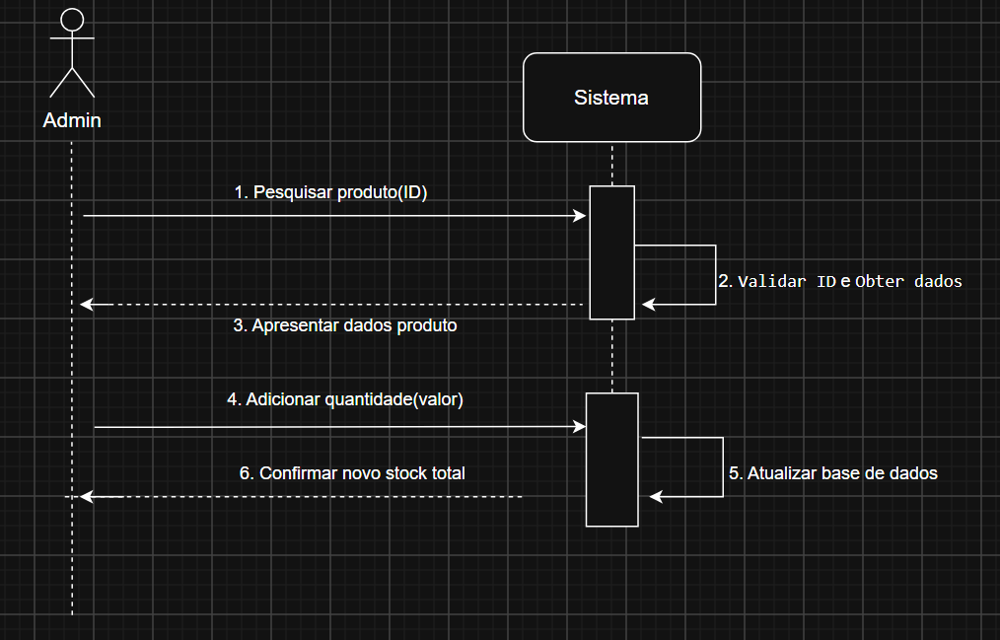

### UC05: Realizar VENDA
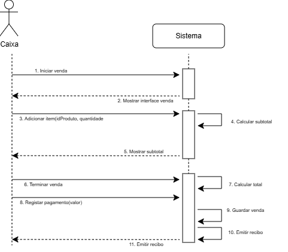

### UC06: Consultar Preço
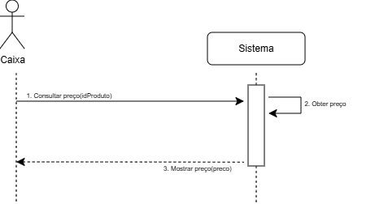

### UC07: Consultar Info e Histórico
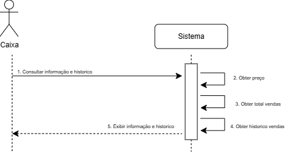

### UC08: Gerir CLIENTES
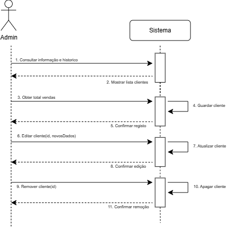

### UC09: Associar CLIENTE
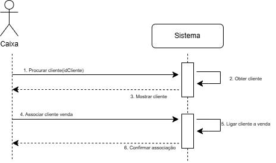

### UC10: Consultar Pontos do CLIENTE
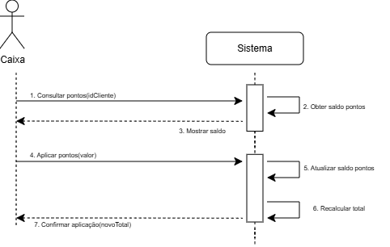

### UC11: Gerir PROMOÇÕES
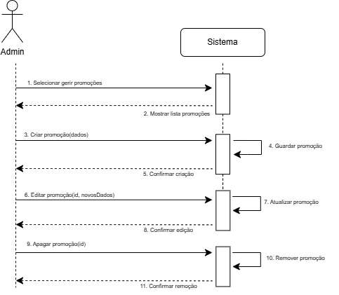

### UC12: Gerir CATEGORIAS
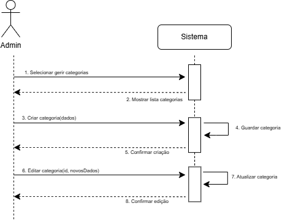

### UC13: Selecionar Perfil
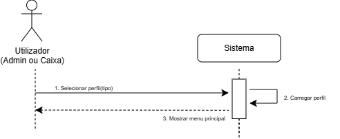

### UC14: Sair do Perfil
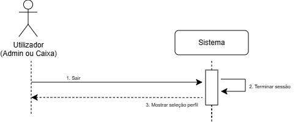

### UC15: Consultar RECIBO
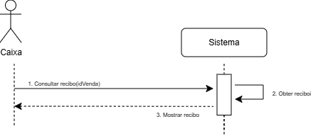
