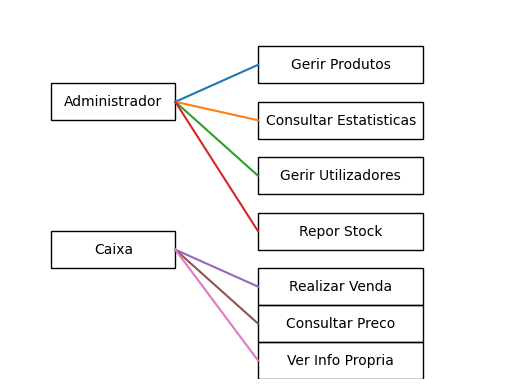
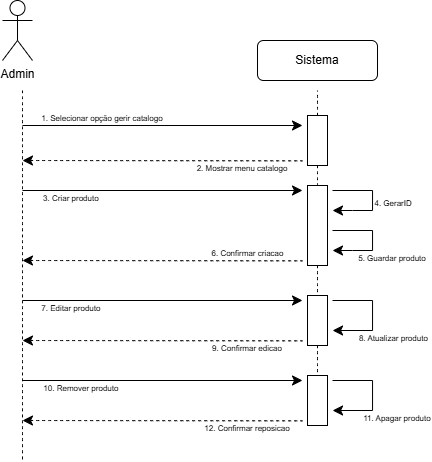
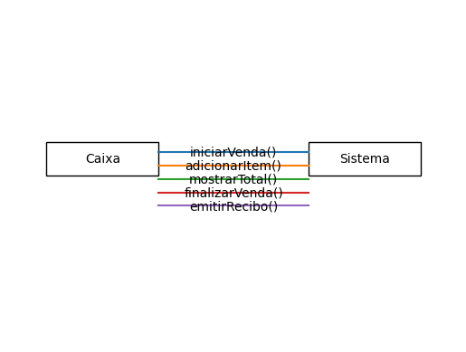

# Modelo de Casos de Uso

Nesta secção detalhamos as interações entre os atores e o sistema.

| ID | Caso de Uso | Ator(es) | Descrição Resumida |
| :--- | :--- | :--- | :--- |
| **UC01** | Gerir Catálogo | Admin | Permite criar, editar, listar e remover produtos (com ID automático). |
| **UC02** | Consultar Estatísticas | Admin | Gera relatórios de faturação e volume por caixa ou global. |
| **UC03** | Gerir Utilizadores | Admin | Permite o registo e remoção de contas de perfil 'Caixa'. |
| **UC04** | Repor Stock | Admin | Incrementa a quantidade disponível de um produto existente. |
| **UC05** | Realizar Venda | Caixa | Inicia transação, adiciona itens, calcula total e regista pagamento. |
| **UC06** | Consultar Preço | Caixa | Pesquisa e exibe o preço unitário de um produto pelo seu ID. |
| **UC07** | Consultar Info e Histórico | Caixa | Exibe dados do funcionário, o seu total e histórico detalhado de vendas. |
| **UC08** | Gerir Clientes | Admin | Permite o registo, edição e remoção de perfis de Cliente com fidelização. |
| **UC09** | Associar Cliente | Caixa | Durante a venda, permite ligar a transação a um Cliente existente. |
| **UC10** | Gerir Pontos do Cliente | Caixa | Permite consultar saldo e aplicar pontos para abater no valor da fatura. |
| **UC11** | Gerir Promoções | Admin | Permite criar, editar e apagar promoções temporais. |
| **UC12** | Gerir Categorias | Admin | Permite agrupar produtos em categorias para fins de IVA e Descontos. |
| **UC13** | Selecionar Perfil | Admin, Caixa | Identifica o utilizador e o seu papel (sem password) para aceder ao sistema. |
| **UC14** | Sair do Perfil | Admin, Caixa | Termina a sessão do utilizador atual, regressando ao menu de seleção. |
| **UC15** | Consultar Recibo | Caixa | Permite consultar e visualizar o recibo de uma venda terminada. |

## Diagramas de Sequência de Sistema (SSD)
Os SSDs detalham as trocas de mensagens entre o Ator e o Sistema (tratado como caixa preta) para os fluxos principais.

### UC05: Gerir Catálogo

### UC05: Realizar Venda

*(Inserir aqui diagrama SSD para UC01)*
