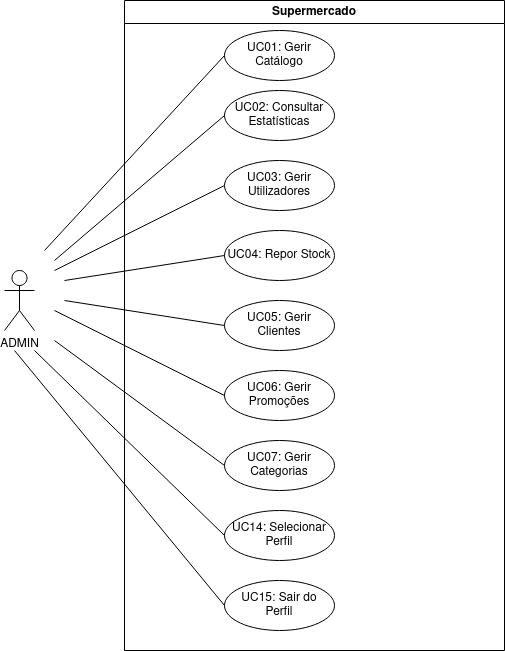
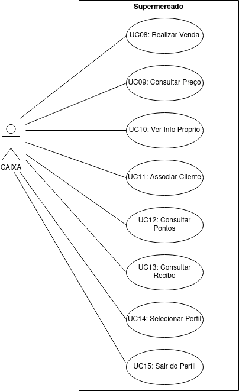

# Modelo de Casos de Uso

Nesta secção detalhamos as interações entre os atores e o sistema.

## Diagrama de Casos de Uso (Administrador)

## Diagrama de Casos de Uso (Caixa)

| ID | Caso de Uso | Ator(es) | Descrição Resumida |
| :--- | :--- | :--- | :--- |
| **UC01** | Gerir Catálogo | ADMIN | Permite criar, editar, listar e remover PRODUTOS. |
| **UC02** | Consultar Estatísticas | ADMIN | Gera relatórios de faturação e volume por CAIXA ou global. |
| **UC03** | Gerir Utilizadores | ADMIN | Permite o registo e remoção de contas de perfil 'CAIXA'. |
| **UC04** | Repor Stock | ADMIN | Incrementa a quantidade disponível de um PRODUTO existente. |
| **UC05** | Gerir CLIENTES | ADMIN | Permite o registo, edição e remoção de perfis de CLIENTE. |
| **UC06** | Gerir PROMOÇÕES | ADMIN | Permite criar, editar e apagar PROMOÇÕES temporárias. |
| **UC07** | Gerir CATEGORIAS | ADMIN | Agrupar PRODUTOS para fins de IVA e Descontos. |
| **UC08** | Realizar VENDA | CAIXA | Inicia transação, adiciona itens, calcula total e regista pagamento. |
| **UC09** | Consultar Preço | CAIXA | Pesquisa e exibe o preço unitário de um PRODUTO pelo seu ID. |
| **UC10** | Ver Info Própria | CAIXA | Exibe dados do funcionário e total de vendas faturado. |
| **UC11** | Associar CLIENTE | CAIXA | Durante a VENDA, permite ligar a transação a um CLIENTE. |
| **UC12** | Consultar Pontos | CAIXA | Visualizar saldo de pontos do CLIENTE. |
| **UC13** | Consultar RECIBO | CAIXA | Consultar e visualizar o RECIBO de uma VENDA terminada. |
| **UC14** | Selecionar Perfil | ADMIN, CAIXA | Identifica o utilizador e o seu papel para aceder ao sistema. |
| **UC15** | Sair do Perfil | ADMIN, CAIXA | Termina a sessão do utilizador atual. |

## Especificações de Casos de Uso

### UC01: Gerir Catálogo
| Campo | Descrição |
| :--- | :--- |
| **Actor** | ADMIN |
| **Use case name** | Gerir Catálogo |
| **Description** | Permite ao ADMIN criar, editar, listar e remover PRODUTOS. |
| **Precondition** | ADMIN selecionado no sistema. |
| **Postcondition** | Catálogo de PRODUTOS atualizado na base de dados. |
| **Main flow** | 1. O ADMIN seleciona a opção "gestão do catálogo".   2. O sistema mostra as opções disponíveis (Criar, Editar, Listar, Remover).   3. O ADMIN seleciona "Criar".   4. O sistema pede os dados (nome, preço base, stock inicial, categoria).   5. O ADMIN introduz os dados.   6. O sistema valida os dados, cria um ID automático e grava.   7. O sistema confirma o sucesso da operação. |
| **Alternative path** | **3.a. Listar:**   1. O ADMIN seleciona "Listar".   2. O sistema apresenta a lista de todos os produtos e respetivos detalhes.   3. O UC termina.    **3.b. Editar:**   1. O ADMIN seleciona a opção "Editar".   2. O sistema pede o ID do produto.   3. O ADMIN escreve o ID.   4. O sistema mostra os dados atuais e pede novos dados.   5. O ADMIN insere os novos dados.   6. O sistema valida e atualiza o produto.   7. O UC termina.    **3.c. Remover:**   1. O ADMIN seleciona "Remover".   2. O sistema pede o ID do produto.   3. O ADMIN insere o ID.   4. O sistema  confirmação.   5. O ADMIN confirma.   6. O sistema remove o produto    7. O UC termina. |

### UC02: Consultar Estatísticas
| Campo | Descrição |
| :--- | :--- |
| **Actor** | ADMIN |
| **Use case name** | Consultar Estatísticas |
| **Description** | Permite visualizar relatórios de faturação global ou por CAIXA. |
| **Precondition** | ADMIN selecionado no sistema. |
| **Postcondition** | N/A |
| **Main flow** | 1. O ADMIN seleciona a opção de "consulta de estatísticas".   2. O sistema pede o filtro (global ou por utilizador CAIXA).   3. O ADMIN escolhe o filtro.   4. O sistema cria e apresenta o relatório de faturação e quantidade de vendas. |
| **Alternative path** | N/A |

### UC03: Gerir Utilizadores
| Campo | Descrição |
| :--- | :--- |
| **Actor** | ADMIN |
| **Use case name** | Gerir Utilizadores |
| **Description** | Permite registar e remover contas de perfil 'CAIXA'. |
| **Precondition** | ADMIN selecionado no sistema. |
| **Postcondition** | Lista de CAIXAs é atualizada. |
| **Main flow** | 1. O ADMIN seleciona a opção "gestão de utilizadores".   2. O sistema mostra as opções (Registar, Listar, Remover).   3. O ADMIN seleciona "Registar".   4. O ADMIN introduz os dados do novo CAIXA (nome).   5. O sistema verifica os dados e cria a conta de perfil 'CAIXA'.   6. O sistema confirma a criação com sucesso. |
| **Alternative path** | **3.b. Remover:**   1. O ADMIN seleciona a opção "Remover".   2. O sistema pede o ID do CAIXA.   3. O ADMIN escrve o ID.   4. O sistema pede confirmação.   5. O ADMIN confirma.   6. O sistema remove a conta e informa o sucesso.   7. O UC termina. |

### UC04: Repor Stock
| Campo | Descrição |
| :--- | :--- |
| **Actor** | ADMIN |
| **Use case name** | Repor Stock |
| **Description** | Aumenta a quantidade disponível de um PRODUTO existente. |
| **Precondition** | ADMIN selecionado no sistema. |
| **Postcondition** | Stock do PRODUTO é incrementado. |
| **Main flow** | 1. O ADMIN pesquisa o PRODUTO pelo ID.   2. O sistema mostra os dados atuais do PRODUTO.   3. O ADMIN introduz a quantidade a adicionar ao stock.   4. O sistema atualiza o valor do stock na base de dados.   5. O sistema confirma o novo valor total de stock. |
| **Alternative path** | N/A |

### UC05: Gerir CLIENTES
| Campo | Descrição |
| :--- | :--- |
| **Actor** | ADMIN |
| **Use case name** | Gerir CLIENTES |
| **Description** | Permite registar, editar e remover perfis de CLIENTE. |
| **Precondition** | ADMIN selecionado no sistema. |
| **Postcondition** | Base de dados de CLIENTES atualizada. |
| **Main flow** | 1. O ADMIN escolhe a opção "gestão de CLIENTES".   2. O sistema mostra as opções (Registar, Editar, Listar, Remover).   3. O ADMIN seleciona a opção "Registar".   4. O ADMIN introduz o NIF e o nome do CLIENTE.   5. O sistema valida o NIF, coloca o saldo de pontos a zero e guarda o perfil.   6. O sistema confirma o sucesso da operação. |
| **Alternative path** | **3.a. Listar:**   1. O ADMIN seleciona a opção "Listar".   2. O sistema apresenta a lista de todos os CLIENTES (NIF, Nome, Pontos).   3. O UC termina.    **3.b. Editar:**   1. O ADMIN seleciona a opção "Editar".   2. O sistema solicita o NIF do CLIENTE.   3. O ADMIN insere o NIF.   4. O sistema mostra os dados atuais e solicita novo nome.   5. O ADMIN insere o novo nome.   6. O sistema atualiza o perfil.   7. O UC termina.    **3.c. Remover:**   1. O ADMIN seleciona a opção "Remover".   2. O sistema solicita o NIF do CLIENTE.   3. O ADMIN insere o NIF.   4. O sistema pede confirmação.   5. O ADMIN confirma.   6. O sistema remove o perfil e informa o sucesso.   7. O UC termina. |

### UC06: Gerir PROMOÇÕES
| Campo | Descrição |
| :--- | :--- |
| **Actor** | ADMIN |
| **Use case name** | Gerir PROMOÇÕES |
| **Description** | Permite criar e configurar regras de descontos temporários. |
| **Precondition** | ADMIN selecionado no sistema. |
| **Postcondition** | Base de dados de PROMOÇÕES atualizada. |
| **Main flow** | 1. O ADMIN escolhe a opção "Gestão de PROMOÇÕES.   2. O sistema mostra as opções (Criar, Listar, Remover).   3. O ADMIN seleciona "Criar".   4. O ADMIN define a percentagem de desconto e as datas de inicio e final.   5. O ADMIN associa a PROMOÇÃO a um PRODUTO ou CATEGORIA específica.   6. O sistema valida e guarda a regra de desconto.   7. O sistema confirma o sucesso. |
| **Alternative path** | **3.a. Listar:**   1. O ADMIN seleciona "Listar".   2. O sistema apresenta a lista de todas as PROMOÇÕES ativas e agendadas.   3. O UC termina.    **3.b. Remover:**   1. O ADMIN seleciona a opção "Remover".   2. O sistema solicita a identificação da promoção.   3. O ADMIN seleciona a promoção a remover.   4. O sistema pede confirmação.   5. O ADMIN confirma.   6. O sistema remove a regra de desconto e informa o sucesso.   7. O UC termina. |

### UC07: Gerir CATEGORIAS
| Campo | Descrição |
| :--- | :--- |
| **Actor** | ADMIN |
| **Use case name** | Gerir CATEGORIAS |
| **Description** | Permite agrupar PRODUTOS em CATEGORIAS para find de impostos e descontos. |
| **Precondition** | ADMIN selecionado no sistema. |
| **Postcondition** | Lista de CATEGORIAS atualizada. |
| **Main flow** | 1. O ADMIN escolhe a opção "gestão de categorias".   2. O sistema apresenta as opções (Criar, Listar).   3. O ADMIN seleciona "Criar".   4. O ADMIN introduz o nome da nova CATEGORIA e a taxa de IVA dessa CATEGORIA.   5. O sistema valida os dados e cria a CATEGORIA.   6. O sistema confirma a criação com sucesso. |
| **Alternative path** | 3.a. O ADMIN seleciona "Listar": O sistema apresenta todas as categorias e taxas de IVA que existem. |

### UC08: Realizar VENDA
| Campo | Descrição |
| :--- | :--- |
| **Actor** | CAIXA |
| **Use case name** | Realizar VENDA |
| **Description** | Realiza uma VENDA de PRODUTOS a um CLIENTE ou a alguém que não é um CLIENTE. |
| **Precondition** | CAIXA selecionado no sistema. |
| **Postcondition** | VENDA registada, o stock atualizado e RECIBO emitido. |
| **Main flow** | 1. O CAIXA seleciona a opção de iniciar uma nova VENDA.   2. O CAIXA introduz o ID e quantidade de cada PRODUTO.   3. O sistema valida o item, calcula o subtotal e apresenta-o.   4. O CAIXA termina a introdução de itens.   5. O sistema calcula o total final (aplica impostos e promoções).   6. O CAIXA regista o pagamento.   7. O sistema acaba a VENDA e emite o RECIBO. |
| **Alternative path** | **6.a. Cancelar VENDA:**   1. O CAIXA solicita o cancelamento da venda antes do pagamento.   2. O sistema pede confirmação.   3. O CAIXA confirma.   4. O sistema descarta os dados da venda em curso e liberta o stock reservado.   5. O UC termina. |

### UC09: Consultar Preço
| Campo | Descrição |
| :--- | :--- |
| **Actor** | CAIXA |
| **Use case name** | Consultar Preço |
| **Description** | Pesquisa e mostra o preço de um PRODUTO pelo seu ID. |
| **Precondition** | CAIXA selecionado no sistema. |
| **Postcondition** | N/A (Consulta). |
| **Main flow** | 1. O CAIXA escreve o ID do PRODUTO.   2. O sistema pesquisa o ID.   3. O sistema apresenta o nome e o preço do PRODUTO. |
| **Alternative path** | N/A |

### UC10: Ver Info Própria
| Campo | Descrição |
| :--- | :--- |
| **Actor** | CAIXA |
| **Use case name** | Ver Info Própria |
| **Description** | Mostra os dados do utilizador CAIXA e o total de dinheiro das vendas acumulado. |
| **Precondition** | CAIXA selecionado no sistema. |
| **Postcondition** | N/A (Consulta). |
| **Main flow** | 1. O CAIXA solicita a opção de ver a sua informação.   2. O sistema apresenta os dados do perfil (ID, nome) e o total faturado acumulado. |
| **Alternative path** | N/A |

### UC11: Associar CLIENTE
| Campo | Descrição |
| :--- | :--- |
| **Actor** | CAIXA |
| **Use case name** | Associar CLIENTE |
| **Description** | Durante uma VENDA, associa o CLIENTE à transação. |
| **Precondition** | VENDA em curso. |
| **Postcondition** | CLIENTE está associado à VENDA. |
| **Main flow** | 1. O CAIXA solicita a  opção de "associação de um CLIENTE."   2. O CAIXA introduz o NIF do CLIENTE.   3. O sistema valida o NIF e mostra o nome correspondente.   4. O sistema liga o CLIENTE à VENDA atual. |
| **Alternative path** | N/A |

### UC12: Consultar Pontos
| Campo | Descrição |
| :--- | :--- |
| **Actor** | CAIXA |
| **Use case name** | Consultar Pontos |
| **Description** | Permite consultar o saldo de pontos atual de um CLIENTE. |
| **Precondition** | CAIXA selecionado no sistema. |
| **Postcondition** | N/A (Consulta). |
| **Main flow** | 1. O CAIXA introduz o NIF do CLIENTE.   2. O sistema pesquisa o perfil correspondente.   3. O sistema apresenta o saldo de pontos atual do CLIENTE. |
| **Alternative path** | N/A |

### UC13: Consultar RECIBO
| Campo | Descrição |
| :--- | :--- |
| **Actor** | CAIXA |
| **Use case name** | Consultar RECIBO |
| **Description** | Permite visualizar uma venda já feita. |
| **Precondition** | CAIXA selecionado no sistema. |
| **Postcondition** | N/A (Consulta). |
| **Main flow** | 1. O CAIXA seleciona uma das vendas que efetuou.   2. O sistema pesquisa os dados da venda.   3. O sistema cria e mostra o RECIBO detalhado no ecrã. |
| **Alternative path** | N/A |

### UC14: Selecionar Perfil
| Campo | Descrição |
| :--- | :--- |
| **Actor** | ADMIN, CAIXA |
| **Use case name** | Selecionar Perfil |
| **Description** | Permite ao utilizador do programa identificar-se (ADMIN ou CAIXA) e aceder ao menu de opções correspondente. |
| **Precondition** | Sistema no menu de seleção inicial. |
| **Postcondition** | Utilizador selecionado e menu de funções ativo. |
| **Main flow** | 1. O utilizador seleciona o seu perfil (ADMIN ou um CAIXA específico) de uma lista apresentada.   2. O sistema verifica as permissões do perfil.   3. O sistema apresenta o menu de operações ao papel selecionado. |
| **Alternative path** | N/A|

### UC15: Sair do Perfil
| Campo | Descrição |
| :--- | :--- |
| **Actor** | ADMIN, CAIXA |
| **Use case name** | Sair do Perfil |
| **Description** | Termina a sessão do utilizador atual. |
| **Precondition** | Utilizador com ADMIN selecionado OU CAIXA selecionado no sistema. |
| **Postcondition** | Sessão terminada e sistema regressa ao menu de seleção inicial. |
| **Main flow** | 1. O utilizador seleciona a opção de "Logout".   2. O sistema limpa os dados de sessão atuais.   3. O sistema regressa ao menu de seleção de perfil inicial. |
| **Alternative path** | N/A |

## Diagramas de Sequência de Sistema (SSD)

### UC01: Gerir Catálogo (Cenário de Criação)

### UC02: Consultar Estatísticas

### UC03: Gerir Utilizadores (Cenário de Registo)

### UC04: Repor Stock

### UC05: Gerir CLIENTES (Cenário de Registo)

### UC06: Gerir PROMOÇÕES (Cenário de Criação)

### UC07: Gerir CATEGORIAS

### UC08: Realizar VENDA

### UC09: Consultar Preço

### UC10: Ver Info Própria

### UC11: Associar CLIENTE

### UC12: Consultar Pontos

### UC13: Consultar RECIBO

### UC14: Selecionar Perfil

### UC15: Sair do Perfil

