# Modelo de Casos de Uso

Nesta secção detalhamos as interações entre os atores e o sistema.

| ID | Caso de Uso | Ator(es) | Descrição Resumida |
| :--- | :--- | :--- | :--- |
| **UC01** | Gerir Catálogo | ADMIN | Permite criar, editar, listar e remover PRODUTOS. |
| **UC02** | Consultar Estatísticas | ADMIN | Gera relatórios de faturação e volume por CAIXA ou global. |
| **UC03** | Gerir Utilizadores | ADMIN | Permite o registo e remoção de contas de perfil 'CAIXA'. |
| **UC04** | Repor Stock | ADMIN | Incrementa a quantidade disponível de um PRODUTO existente. |
| **UC05** | Gerir CLIENTES | ADMIN | Permite o registo, edição e remoção de perfis de CLIENTE. |
| **UC06** | Gerir PROMOÇÕES | ADMIN | Permite criar, editar e apagar PROMOÇÕES temporárias. |
| **UC07** | Gerir CATEGORIAS | ADMIN | Agrupar PRODUTOS para fins de IVA e Descontos. |
| **UC08** | Realizar VENDA | CAIXA | Inicia transação, adiciona itens, calcula total e regista pagamento. |
| **UC09** | Consultar Preço | CAIXA | Pesquisa e exibe o preço unitário de um PRODUTO pelo seu ID. |
| **UC10** | Ver Info Própria | CAIXA | Exibe dados do funcionário e total de vendas faturado. |
| **UC11** | Associar CLIENTE | CAIXA | Durante a VENDA, permite ligar a transação a um CLIENTE. |
| **UC12** | Consultar Pontos | CAIXA | Visualizar saldo de pontos do CLIENTE. |
| **UC13** | Consultar RECIBO | CAIXA | Consultar e visualizar o RECIBO de uma VENDA terminada. |
| **UC14** | Selecionar Perfil | ADMIN, CAIXA | Identifica o utilizador e o seu papel para aceder ao sistema. |
| **UC15** | Sair do Perfil | ADMIN, CAIXA | Termina a sessão do utilizador atual. |

## Especificações de Casos de Uso

### UC01: Gerir Catálogo
| Campo | Descrição |
| :--- | :--- |
| **Actor** | ADMIN |
| **Use case name** | Gerir Catálogo |
| **Description** | Permite ao ADMIN gerir os PRODUTOS (criar, editar, listar e remover). |
| **Precondition** | ADMIN autenticado no sistema. |
| **Postcondition** | Catálogo de PRODUTOS atualizado na base de dados. |
| **Main flow** | 1. O ADMIN solicita a gestão do catálogo.   2. O sistema mostra as opções disponíveis (Criar, Editar, Listar, Remover).   3. O ADMIN seleciona "Criar".   4. O sistema solicita os dados (nome, preço, stock, categoria).   5. O ADMIN introduz os dados.   6. O sistema valida os dados, gera um ID automático e grava.   7. O sistema confirma o sucesso da operação. |
| **Alternative path** | 3.a. O ADMIN seleciona "Editar": O sistema solicita o ID e novos dados.   3.b. O ADMIN seleciona "Remover": O sistema solicita o ID e confirma a remoção. |
| **Exceptions** | 6.a. Dados inválidos (ex: preço ou stock negativo): o sistema alerta o erro e solicita nova introdução.   6.b. Produto com o mesmo nome já existente: o sistema avisa o conflito. |

### UC02: Consultar Estatísticas
| Campo | Descrição |
| :--- | :--- |
| **Actor** | ADMIN |
| **Use case name** | Consultar Estatísticas |
| **Description** | Permite visualizar relatórios de faturação global ou por CAIXA. |
| **Precondition** | ADMIN autenticado no sistema. |
| **Postcondition** | N/A (Consulta). |
| **Main flow** | 1. O ADMIN solicita a consulta de estatísticas.   2. O sistema solicita o filtro desejado (global ou por utilizador CAIXA).   3. O ADMIN escolhe o filtro.   4. O sistema gera e apresenta o relatório de faturação e volume de vendas. |
| **Alternative path** | N/A |
| **Exceptions** | 4.a. Sem dados de vendas registados para o filtro selecionado: o sistema informa o estado vazio. |

### UC03: Gerir Utilizadores
| Campo | Descrição |
| :--- | :--- |
| **Actor** | ADMIN |
| **Use case name** | Gerir Utilizadores |
| **Description** | Permite o registo e remoção de contas de perfil 'CAIXA'. |
| **Precondition** | ADMIN autenticado no sistema. |
| **Postcondition** | Lista de utilizadores autorizados é atualizada. |
| **Main flow** | 1. O ADMIN solicita a gestão de utilizadores.   2. O sistema mostra as opções (Registar, Remover).   3. O ADMIN seleciona "Registar".   4. O ADMIN introduz os dados do novo CAIXA (nome, etc.).   5. O sistema valida os dados e cria a conta de perfil 'CAIXA'.   6. O sistema confirma a criação com sucesso. |
| **Alternative path** | 3.a. O ADMIN seleciona "Remover": O sistema solicita o ID do CAIXA e remove a conta. |
| **Exceptions** | 5.a. Nome de utilizador já existe: o sistema solicita um identificador único.   3.a.1. ID do CAIXA não encontrado (no caso de remoção): o sistema apresenta erro. |

### UC04: Repor Stock
| Campo | Descrição |
| :--- | :--- |
| **Actor** | ADMIN |
| **Use case name** | Repor Stock |
| **Description** | Incrementa a quantidade disponível de um PRODUTO existente. |
| **Precondition** | ADMIN autenticado no sistema. |
| **Postcondition** | Stock do PRODUTO é incrementado. |
| **Main flow** | 1. O ADMIN pesquisa o PRODUTO pelo seu ID.   2. O sistema apresenta os dados atuais do PRODUTO.   3. O ADMIN introduz a quantidade a adicionar ao stock.   4. O sistema atualiza o valor do stock na base de dados.   5. O sistema confirma o novo valor total de stock. |
| **Alternative path** | N/A |
| **Exceptions** | 1.a. ID do PRODUTO não existe: o sistema informa o erro e solicita nova pesquisa.   3.a. Quantidade introduzida é inválida (ex: negativa): o sistema solicita novo valor. |

### UC05: Gerir CLIENTES
| Campo | Descrição |
| :--- | :--- |
| **Actor** | ADMIN |
| **Use case name** | Gerir CLIENTES |
| **Description** | Permite o registo, edição e remoção de perfis de CLIENTE. |
| **Precondition** | ADMIN autenticado no sistema. |
| **Postcondition** | Base de dados de CLIENTES atualizada. |
| **Main flow** | 1. O ADMIN solicita gestão de CLIENTES.   2. O sistema mostra as opções (Registar, Editar, Remover).   3. O ADMIN seleciona "Registar".   4. O ADMIN introduz o NIF e o nome do CLIENTE.   5. O sistema valida o NIF, inicializa o saldo de pontos a zero e guarda o perfil.   6. O sistema confirma o sucesso da operação. |
| **Alternative path** | 3.a. O ADMIN seleciona "Editar": O sistema permite mudar o nome do CLIENTE.   3.b. O ADMIN seleciona "Remover": O sistema apaga o perfil do CLIENTE. |
| **Exceptions** | 5.a. NIF já registado ou formato inválido: o sistema apresenta erro e solicita novo dado.   3.a.1. CLIENTE não encontrado: o sistema alerta o ADMIN. |

### UC06: Gerir PROMOÇÕES
| Campo | Descrição |
| :--- | :--- |
| **Actor** | ADMIN |
| **Use case name** | Gerir PROMOÇÕES |
| **Description** | Permite criar e configurar regras de desconto temporárias. |
| **Precondition** | ADMIN autenticado no sistema. |
| **Postcondition** | Base de dados de PROMOÇÕES atualizada. |
| **Main flow** | 1. O ADMIN solicita a gestão de PROMOÇÕES.   2. O sistema mostra as opções (Criar, Remover).   3. O ADMIN seleciona "Criar".   4. O ADMIN define a percentagem de desconto e as datas de vigência.   5. O ADMIN associa a PROMOÇÃO a um PRODUTO ou CATEGORIA específica.   6. O sistema valida e guarda a regra de desconto. |
| **Alternative path** | 3.a. O ADMIN seleciona "Remover": O sistema apaga a regra de promoção selecionada. |
| **Exceptions** | 6.a. Datas inválidas (ex: data fim anterior à data início): o sistema alerta o ADMIN.   5.a. PRODUTO ou CATEGORIA associada não existe: o sistema apresenta erro. |

### UC07: Gerir CATEGORIAS
| Campo | Descrição |
| :--- | :--- |
| **Actor** | ADMIN |
| **Use case name** | Gerir CATEGORIAS |
| **Description** | Permite agrupar PRODUTOS para fins de IVA e descontos. |
| **Precondition** | ADMIN autenticado no sistema. |
| **Postcondition** | Lista de CATEGORIAS atualizada. |
| **Main flow** | 1. O ADMIN solicita a gestão de categorias.   2. O sistema apresenta as opções (Criar, Listar).   3. O ADMIN seleciona "Criar".   4. O ADMIN introduz o nome da nova CATEGORIA e a respetiva taxa de IVA.   5. O sistema valida os dados e cria a CATEGORIA.   6. O sistema confirma a criação com sucesso. |
| **Alternative path** | 3.a. O ADMIN seleciona "Listar": O sistema apresenta todas as categorias e taxas de IVA configuradas. |
| **Exceptions** | 5.a. Nome de CATEGORIA já existente: o sistema solicita nome diferente.   4.a. Taxa de IVA inválida: o sistema solicita valor numérico correto. |

### UC08: Realizar VENDA
| Campo | Descrição |
| :--- | :--- |
| **Actor** | CAIXA |
| **Use case name** | Realizar VENDA |
| **Description** | Processa uma transação de venda de PRODUTOS a um cliente. |
| **Precondition** | CAIXA autenticado no sistema. |
| **Postcondition** | VENDA registada, stock atualizado e RECIBO emitido. |
| **Main flow** | 1. O CAIXA inicia uma nova VENDA.   2. O CAIXA introduz o ID e quantidade de cada PRODUTO.   3. O sistema valida o item, calcula o subtotal e apresenta-o.   4. O CAIXA termina a introdução de itens.   5. O sistema calcula o total final (aplicando taxas e promoções).   6. O CAIXA regista o pagamento.   7. O sistema finaliza a VENDA e emite o RECIBO. |
| **Alternative path** | 6.a. O CAIXA cancela a VENDA: O sistema descarta os dados e liberta o stock reservado. |
| **Exceptions** | 2.a. ID do PRODUTO é inválido: o sistema avisa o CAIXA e permite nova introdução.   2.b. Stock insuficiente: o sistema alerta para a falta de unidades e não adiciona ao carrinho. |

### UC09: Consultar Preço
| Campo | Descrição |
| :--- | :--- |
| **Actor** | CAIXA |
| **Use case name** | Consultar Preço |
| **Description** | Pesquisa e exibe o preço unitário de um PRODUTO pelo seu ID. |
| **Precondition** | CAIXA autenticado no sistema. |
| **Postcondition** | N/A (Consulta). |
| **Main flow** | 1. O CAIXA introduz o ID do PRODUTO.   2. O sistema pesquisa o ID.   3. O sistema apresenta o nome e o preço unitário do PRODUTO. |
| **Alternative path** | N/A |
| **Exceptions** | 2.a. ID do PRODUTO não encontrado: o sistema informa o erro. |

### UC10: Ver Info Própria
| Campo | Descrição |
| :--- | :--- |
| **Actor** | CAIXA |
| **Use case name** | Ver Info Própria |
| **Description** | Exibe dados do utilizador CAIXA e o total faturado acumulado. |
| **Precondition** | CAIXA autenticado no sistema. |
| **Postcondition** | N/A (Consulta). |
| **Main flow** | 1. O CAIXA solicita a sua informação.   2. O sistema apresenta os dados do perfil (ID, nome) e o total faturado acumulado. |
| **Alternative path** | N/A |
| **Exceptions** | N/A |

### UC11: Associar CLIENTE
| Campo | Descrição |
| :--- | :--- |
| **Actor** | CAIXA |
| **Use case name** | Associar CLIENTE |
| **Description** | Durante uma VENDA, associa o CLIENTE à transação. |
| **Precondition** | VENDA em curso. |
| **Postcondition** | CLIENTE associado à VENDA. |
| **Main flow** | 1. O CAIXA solicita a associação de um CLIENTE.   2. O CAIXA introduz o NIF do CLIENTE.   3. O sistema valida o NIF e apresenta o nome correspondente.   4. O sistema liga o CLIENTE à VENDA atual. |
| **Alternative path** | N/A |
| **Exceptions** | 3.a. NIF não encontrado no sistema: o sistema alerta o CAIXA. |

### UC12: Consultar Pontos
| Campo | Descrição |
| :--- | :--- |
| **Actor** | CAIXA |
| **Use case name** | Consultar Pontos |
| **Description** | Permite visualizar o saldo de pontos atual de um CLIENTE. |
| **Precondition** | CAIXA autenticado no sistema. |
| **Postcondition** | N/A (Consulta). |
| **Main flow** | 1. O CAIXA introduz o NIF do CLIENTE.   2. O sistema pesquisa o perfil correspondente.   3. O sistema apresenta o saldo de pontos atual do CLIENTE. |
| **Alternative path** | N/A |
| **Exceptions** | 2.a. NIF não encontrado: o sistema informa o erro. |

### UC13: Consultar RECIBO
| Campo | Descrição |
| :--- | :--- |
| **Actor** | CAIXA |
| **Use case name** | Consultar RECIBO |
| **Description** | Permite visualizar o detalhe de uma venda efetuada anteriormente. |
| **Precondition** | CAIXA autenticado no sistema. |
| **Postcondition** | N/A (Consulta). |
| **Main flow** | 1. O CAIXA seleciona uma venda do seu histórico recente.   2. O sistema pesquisa os dados da transação.   3. O sistema gera e apresenta o RECIBO detalhado no ecrã. |
| **Alternative path** | N/A |
| **Exceptions** | 2.a. Venda não encontrada ou erro na recuperação de dados: o sistema apresenta mensagem de erro. |

### UC14: Selecionar Perfil
| Campo | Descrição |
| :--- | :--- |
| **Actor** | ADMIN, CAIXA |
| **Use case name** | Selecionar Perfil |
| **Description** | Permite ao utilizador identificar-se e aceder ao menu correspondente. |
| **Precondition** | Sistema no menu de seleção inicial. |
| **Postcondition** | Utilizador autenticado e menu de funções ativo. |
| **Main flow** | 1. O utilizador seleciona o seu perfil (ADMIN ou um CAIXA específico) de uma lista apresentada.   2. O sistema verifica as permissões do perfil.   3. O sistema apresenta o menu de operações adequado ao papel selecionado. |
| **Alternative path** | N/A |
| **Exceptions** | 1.a. Lista de perfis vazia: o sistema permite apenas a criação do primeiro ADMIN. |

### UC15: Sair do Perfil
| Campo | Descrição |
| :--- | :--- |
| **Actor** | ADMIN, CAIXA |
| **Use case name** | Sair do Perfil |
| **Description** | Termina a sessão do utilizador atual. |
| **Precondition** | Utilizador com perfil ativo no sistema. |
| **Postcondition** | Sessão terminada e sistema regressa ao menu de seleção inicial. |
| **Main flow** | 1. O utilizador seleciona a opção "Sair" ou "Logout".   2. O sistema limpa os dados de sessão atuais.   3. O sistema regressa ao menu de seleção de perfil inicial. |
| **Alternative path** | N/A |
| **Exceptions** | N/A |

## Diagramas de Sequência de Sistema (SSD)

### UC01: Gerir Catálogo (Cenário de Criação)
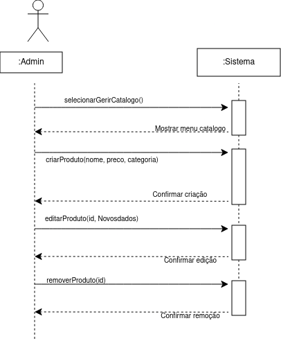

### UC02: Consultar Estatísticas
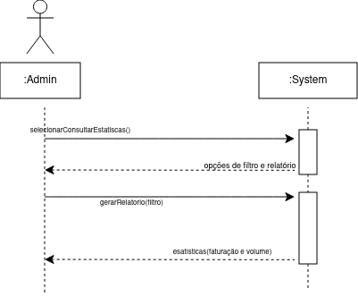

### UC03: Gerir Utilizadores (Cenário de Registo)
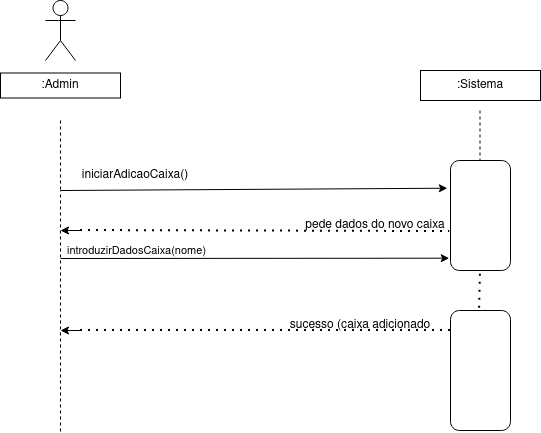

### UC04: Repor Stock
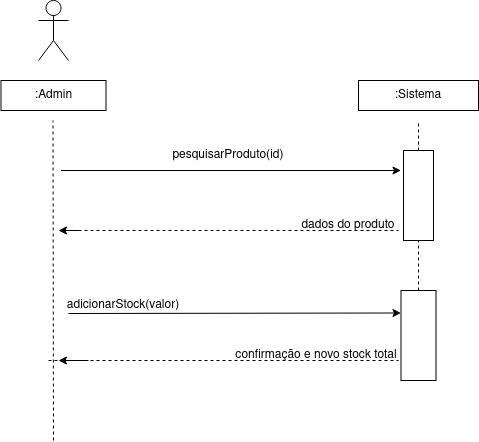

### UC05: Gerir CLIENTES (Cenário de Registo)

### UC06: Gerir PROMOÇÕES (Cenário de Criação)
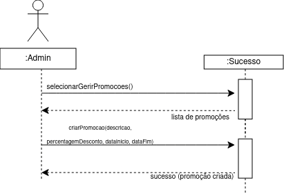

### UC07: Gerir CATEGORIAS

### UC08: Realizar VENDA
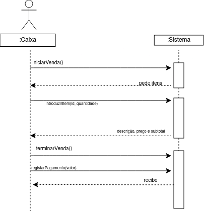

### UC09: Consultar Preço
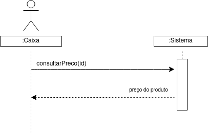

### UC10: Ver Info Própria

### UC11: Associar CLIENTE
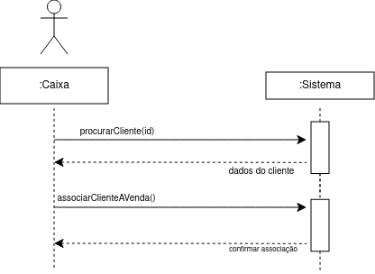

### UC12: Consultar Pontos
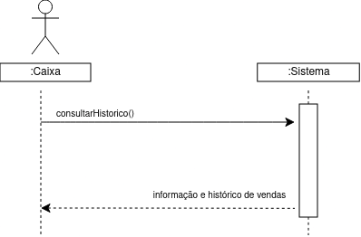

### UC13: Consultar RECIBO
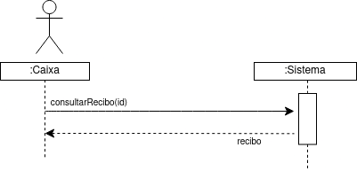

### UC14: Selecionar Perfil
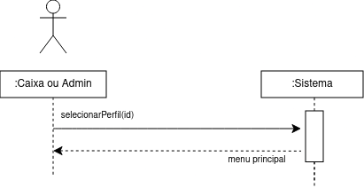

### UC15: Sair do Perfil

