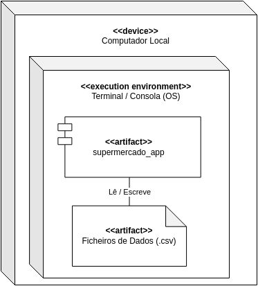
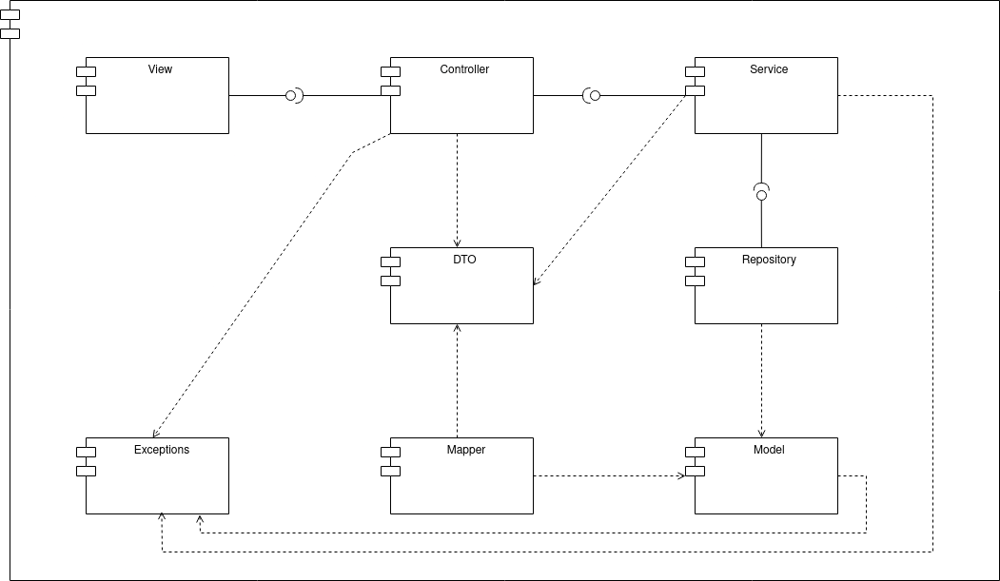
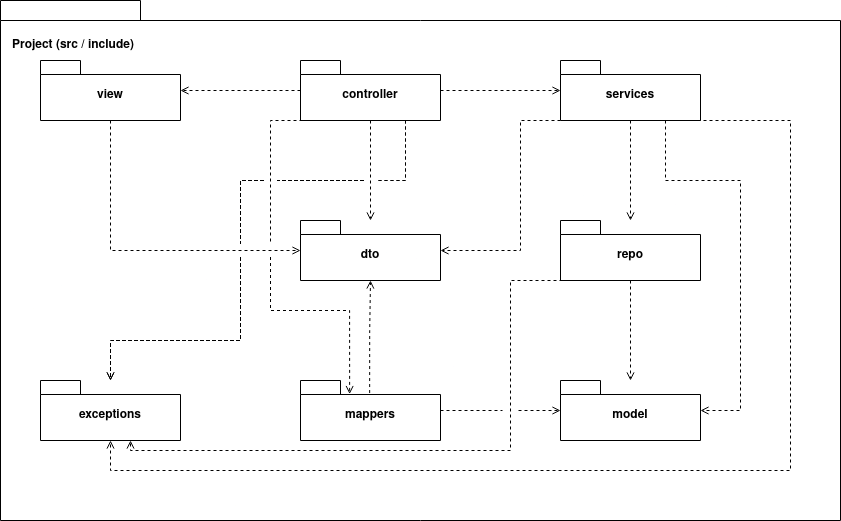
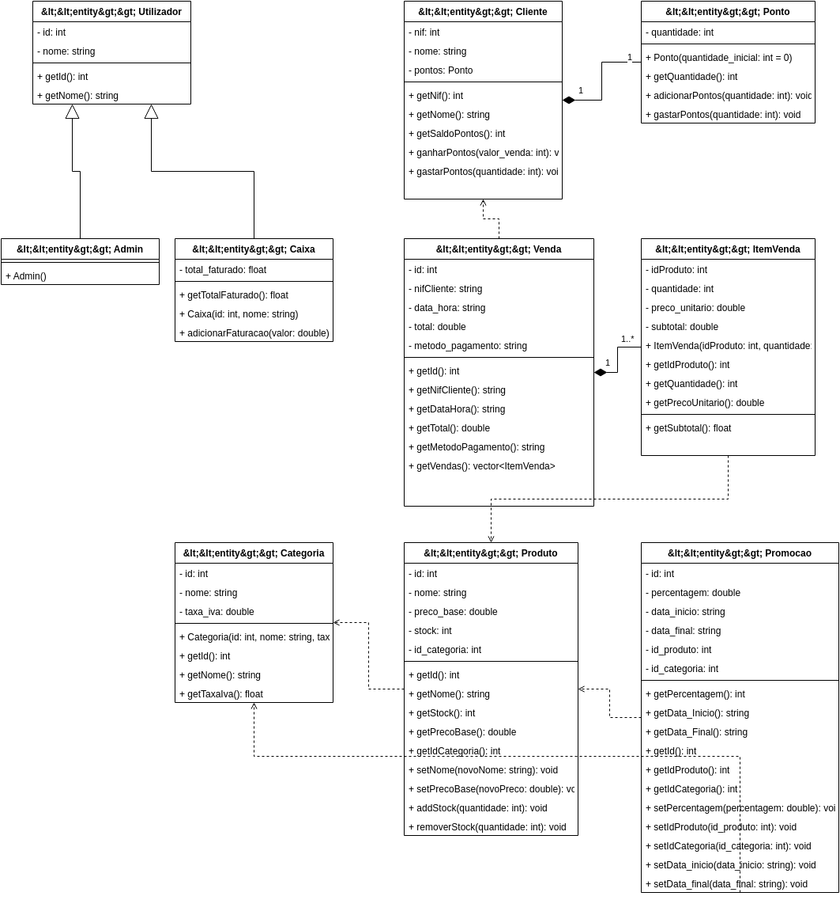
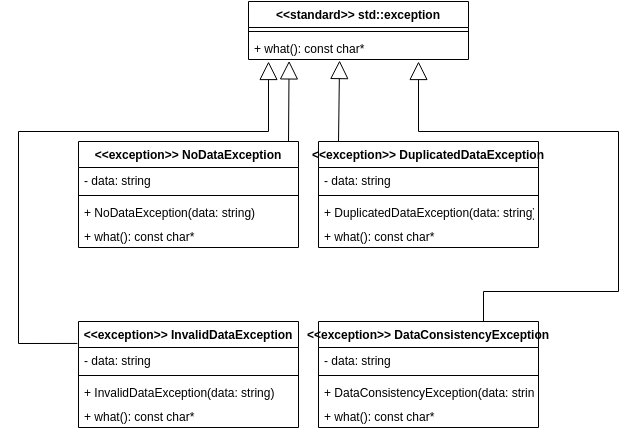
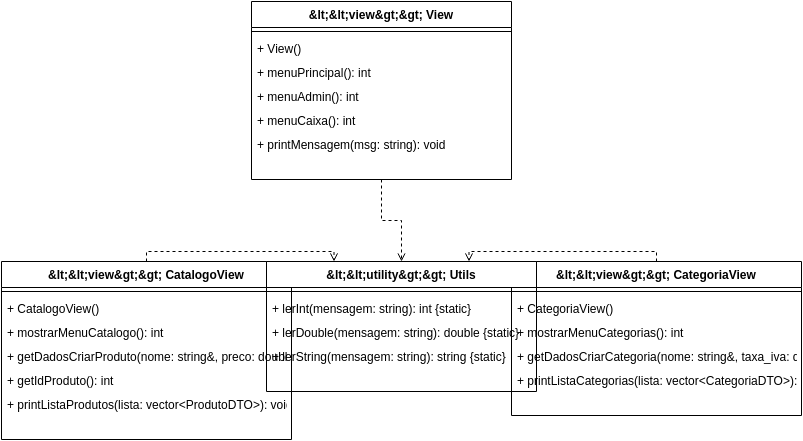
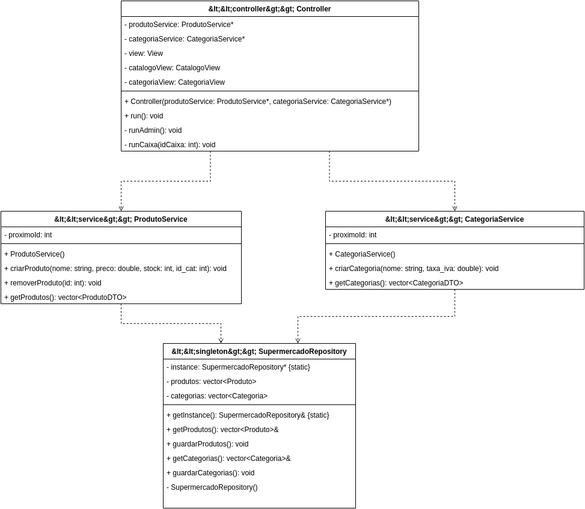
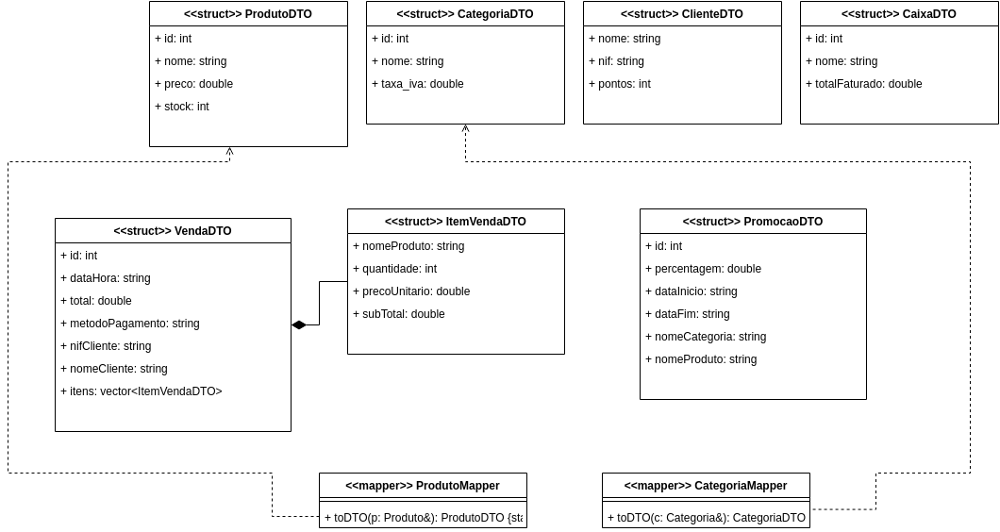

# Design de Software

## Arquitetura Física

## Arquitetura Lógica

## Organização do Código

## Diagrama de Classes do Modelo (Design Class Diagram)

## Diagrama de Classes das Exceções

## Diagrama de Classes das Views

## Diagrama de Classes do Controller, Services e Repository

## Diagrama de DTOs e Mappers

## Padrão Model-View-Controller (MVC)

O sistema foi dividido em camadas seguindo o padrão Model-View-Controller que foi estendido com Services, Repository, DTOs e Mappers:

1. **Model:** Contém as classes de dados (`Produto`, `Categoria`, `Cliente`, `Venda`, `ItemVenda`, `Promocao`, `Ponto`, `Caixa`, `Admin`, `Utilizador`). Estas classes `<<entity>>`, representam as entidades do domínio e não conhecem a parte do View.
2. **View:** Responsável por toda a interação com o utilizador seja a enviar dados ou a pedir dados. Inclui as classes `View` , `CatalogoView`, `CategoriaView` e `Utils` (validar o input do utilizador).
3. **Controller:** A classe `Controller` (com o estereótipo `<<controller>>`) é a classes que orquestra úo funcionamento do sistema. Recebe os Services no construtor, gere o fluxo de navegação entre menus e delega todas as operações de negócio aos Services. Trata exceções com blocos `try/catch` e comunica resultados através da View genérica.
4. **Service:** As classes `ProdutoService` e `CategoriaService` (estereótipo `<<service>>`) contêm a lógica de negócio e validações. Geram IDs automáticos e coordenam a persistência através do Repository.
5. **Repository:** A classe `SupermercadoRepository` (estereótipo `<<singleton>>`) centraliza toda a persistência de dados em ficheiros CSV. É acedida via `getInstance()` e expõe referências para os vectores internos.
6. **DTO:** Estruturas de transferência de dados (estereótipo `<<struct>>`) — `ProdutoDTO`, `CategoriaDTO`, `ClienteDTO`, `CaixaDTO`, `VendaDTO`, `ItemVendaDTO`, `PromocaoDTO` que transportam dados entre camadas sem expor os Models diretamente às Views.
7. **Mappers:** Classes `ProdutoMapper` e `CategoriaMapper` (estereótipo `<<mapper>>`) com métodos estáticos `toDTO()` que convertem Modelos em DTOs.
8. **Exceptions:** Quatro classes de exceção (estereótipo `<<exception>>`) — `NoDataException`, `DuplicatedDataException`, `InvalidDataException`, `DataConsistencyException` que herdam de `std::exception` e são usadas  pelos Services e capturadas pelo Controller.

O fluxo de uma operação típica é: **View** recolhe o input → **Controller** chama **Service** → **Service** valida e usa **Repository** → **Mapper** converte Model → DTO → **Controller** passa DTO à **View** para apresentar.

## Arquitetura de Ficheiros

- **`include/model/`** — Headers das entidades de domínio (`Produto.h`, `Categoria.h`, `Cliente.h`, `Venda.h`, etc.)
- **`include/view/`** — Headers das classes de interface (`View.h`, `CatalogoView.h`, `CategoriaView.h`, `Utils.h`)
- **`include/controller/`** — Header do orquestrador (`Controller.h`)
- **`include/services/`** — Headers da lógica de negócio (`ProdutoService.h`, `CategoriaService.h`)
- **`include/repo/`** — Header do repositório Singleton (`SupermercadoRepository.h`)
- **`include/dto/`** — Estruturas de transferência de dados (`ProdutoDTO.h`, `CategoriaDTO.h`, etc.)
- **`include/mappers/`** — Conversores Model-DTO (`ProdutoMapper.h`, `CategoriaMapper.h`)
- **`include/exceptions/`** — Classes de exceção (`NoDataException.h`, etc.)
- **`src/`** — Implementações correspondentes a cada header, espelhando a mesma estrutura de pastas.

A compilação é gerida pelo `CMakeLists.txt` (C++17, CMake 3.10+) e o ponto onde o programa começa é o `main.cpp`.

## Padrões de Desenho Aplicados (GRASP)
Exemplos de classes onde usamos certos Padroes de desenho:

- **Creator:** O padrão *Creator* é aplicado na classe `SupermercadoRepository`. No método `carregarProdutos()` ocorre a instanciação dos objetos `Produto` depois da a leitura do ficheiro CSV e extração da informaçao la dentro, sendo o repositório o agregador que contém e gere as instâncias de produtos.
- **Controller:** O padrão *Controller* é implementado através da classe `Controller`, que atua como o orquestrador do sistema. Esta classe recebe os eventos da interface (View) e dá "ordens" de execução para as outras camadas.
- **Service:** O padrão *Service* é utilizado na classe `ProdutoService`, onde está a lógica de negócio associada aos produtos (como a atribuição de um ID automático e as verificações que os dados são válidos).
