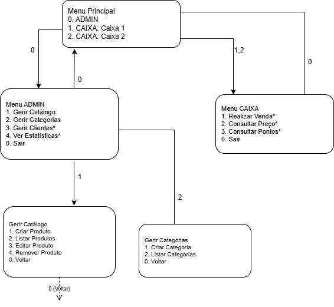

# Interface de Utilizador

A aplicação utiliza uma interface de linha de comandos (CLI) baseada em menus numéricos. A navegação é feita através da classe `View`, que apresenta menus e recolhe opções do utilizador. As opções assinaladas com (*) encontram-se em desenvolvimento.

